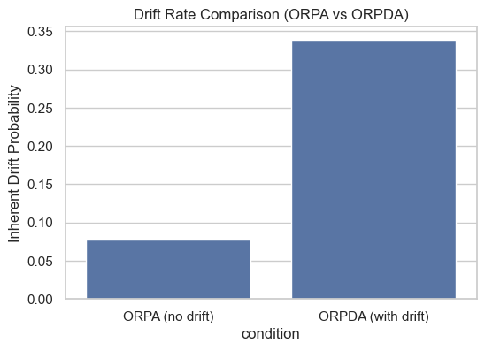
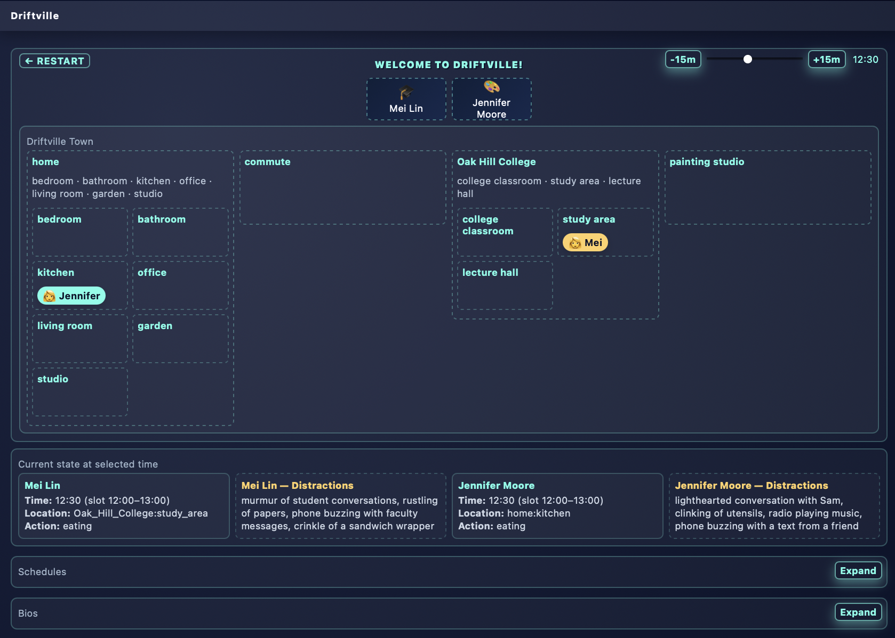
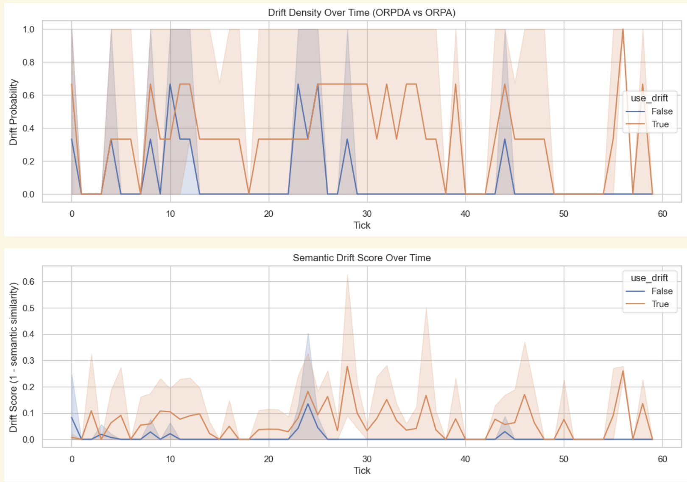

# Driftville: Where Minds Drift (Through the ORPDA Architecture)

**🚀 Why Driftville?**

Humans rarely follow plans. Our mind wanders ~47% of waking hours.

Most LLM agents today operate inside simplified cognitive loops—typically variants of Observe → Reflect → Plan → Act. These architectures assume stable attention, perfect goal adherence, and minimal internal variability. Real humans do not behave this way. We drift, ruminate, get distracted, recover, and reorient throughout the day.

**✅ Driftville was designed to close this gap.**

This framework introduces **ORPDA** (**Observe → Reflect → Plan → Drift (new) → Act**), a novel cognitive cycle that explicitly models drift as a first-class operator. By instrumenting an agent’s internal reasoning steps and evaluating its behavior over long simulated timelines, Driftville enables:
- Research-grade analysis of attention stability, cognitive drift, and emotional resilience
- Quantitative comparisons between idealized agents (ORPA) and realistic agents (ORPDA)
- Transparent, interpretable traces that reveal how an LLM’s internal “inner voice” evolves over time
- Benchmarking of agent personas for coaching, education, enterprise decision-making, and human-facing applications
- A sandbox for behavioral experiments, including conflict simulation, team dynamics, and population-level cognitive modeling

  

**📊 Outcome**

This bar chart shows the agent’s inherent probability of drifting away from its scheduled action. ORPDA’s drift layer increases baseline drift by ~4× compared to ORPA, producing internal variability that more closely resembles human attention patterns. ORPA, by contrast, remains largely stable and goal-locked.

  

## Quick Start
1) **Env vars**: create .env with your `GOOGLE_API_KEY`.
2) **Install deps**: `pip install -r requirements.txt`
3) **Set config**: in `app/config/config.yaml`
    - set `MODEL_NAME` to be used by agents (default: `gemini-2.5-flash-lite`).
 	- set `use_drift` to **True** (to run ORPDA loop).
  	- set `use_drift` to **False** (to run ORPA loop).	
4) **Run main simulation**: `python app/src/simulate.py` (it generates logs to `app/logs/`).
5) **UI preview** (visual only; no ORPDA execution yet):
   `python app2/app2.py`
   Then open the printed URL (default: http://127.0.0.1:5000)

	

## System Architecture (ORPDA)

ORPDA is a cognitive simulation loop designed to model and evaluate human-like variability in LLM reasoning. It extends the classic ORPA pipeline with an explicit Drift step:

Agent roles:
- **Observer**: emits structured state snapshots (`app/src/yaml/observer.yaml`).
- **Reflector**: assesses alignment/stability (`app/src/yaml/reflector.yaml`).
- **Planner**: generates the next 15-min plan block (`app/src/yaml/planner.yaml`).
- **Drifter**: injects cognitive drift decisions (`app/src/yaml/drifter.yaml`).
- **Actor**: commits the executed action for the next loop (`app/src/yaml/actor_orpda.yaml`).

## Resemblence to neuroscience Default Mode Network (DMN)
With ORPDA, it resembles human drift mind throughout the time. Without drift agent layer, drift tends to happend only at the beginning and topic of drift also looses diversity.
- ORPDA (orange) shows frequent, distributed drift events throughout the 60 ticks.

This pattern resembles human cognition: 
humans don’t drift once; we drift repeatedly and intermittently over the day.

- ORPA (blue) — the version without the drift agent — shows drift mostly:
	- in the early ticks (startup instability),
	- but becomes flat and stable for long stretches.

➤ Interpretation:
ORPDA produces cognitively realistic “micro-instabilities” over time, while ORPA locks into a rigid behavioral groove.

	  

## YAML
- YAML agent configs live in `app/src/yaml/` (`root_agent.yaml`, `observer.yaml`, etc.).
- Programmatic runner: `app/src/orpda_runner.py` exposes `run_orpda_cycle(ctx)`; call with a context dict (raw persona, last_action_result, recent_history, current_datetime).

## Simulation CLI
- Run the full ORPDA simulation loop:
    `app/src/simulate.py` 
- Personas are defined in `app/src/driftville_personas.json` (generated using `persona_injector.yaml` LLM agent)
- To control start time (after adding the argparse flag as needed), pass `--sim-start "YYYY-MM-DD HH:MM"`.

## Logs
- Session logs (raw ORPDA loop output): `app/logs/session_*.log`
- Memory streams (summarized long-term memory): `app/logs/memory_streams*.log`

## Metrics & Ablation
- `app/src/metrics.py` compares ORPDA (with drift) vs ORPA (no drift).
- Compute and plot:
   python -m app.src.metrics
- Outputs: `app/logs/metrics.json`.

## Personas
- Raw bios: `app/src/smallville_personas.json` (Copied from `https://reverie.herokuapp.com/UIST_Demo/`. Used as SEED personality for Driftville. )
- Driftville personas and schedules: `app/src/driftville_personas.json`
- UI persona loader (arcade-style): `app2/app2.py`

## Development Notes
- Keep `sys.path` setup at the top of scripts when running as plain Python (`Path(__file__).resolve().parents[2]`).
- Avoid hard resets; logs are useful for debugging.

## Referenced work:
This project draws conceptual inspiration from Smallville (Park et al., 2023) but diverges significantly in scope and methodology, focusing on internal cognitive modeling rather than multi-agent social emergence.

In contrast to social-emergence environments like Smallville (2023), Driftville focuses on cognitive fidelity over social fidelity. It is not about building towns—it is about understanding minds.
By providing drift-aware reasoning, memory streams, and structured ablation metrics, Driftville supports both academic research and real-world agent evaluation.

- Joon Sung Park, Joseph C. O’Brien, Carrie J. Cai, Meredith Ringel Morris, Percy Liang, and Michael S. Bernstein. 2023. Generative Agents: Interactive Simulacra of Human Behavior. In The 36th Annual ACM Symposium on User Interface Software and Technology (UIST ’23), October 29-November 1, 2023, San Francisco, CA, USA. ACM, New York, NY, USA, 22 pages. https://doi.org/10.1145/3586183.3606763
