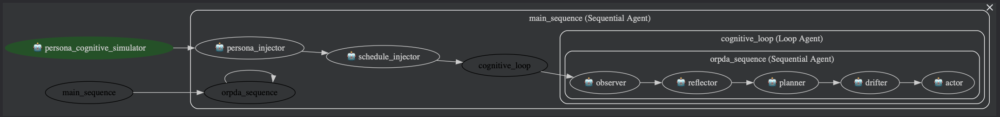
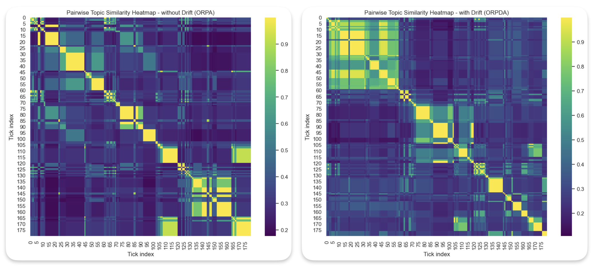

# Driftville: Understanding LLM Attention, Drift, and Emotional Stability Through ORPDA

  

A cognitive simulation framework that models and evaluates an LLM agent’s internal reasoning loop (**Observe → Reflect → Plan → Drift → Act**) to study attention stability, behavioral drift, emotional resilience, and long-horizon planning.

  

## Why Driftville
Most LLM agents assume perfect attention and goal adherence. Driftville introduces ORPDA, a loop that treats drift as a first-class operator, enabling research-grade analysis of attention stability, cognitive drift, and emotional resilience with interpretable traces over long timelines.

## System Architecture
- Diagram: `tools/ORPDA.png` (or `ORPDA_architecture.png`).
- Flow: Observer → Reflector → Planner → Drifter → Actor orchestrated by `SequentialAgent` (`app/src/yaml/orpda_sequence.yaml`) and built via `build_agent` (`app/src/orpda_runner.py:42-103`).
- Runner: `run_orpda_cycle` executes the pipeline and extracts structured JSON (`app/src/orpda_runner.py:108-155`).
- Simulator: `run_simulation` advances time, logs sessions, and streams memory summaries (`app/src/simulate.py:165-254`).

Agent roles:
- Observer: emits structured state snapshots (`app/src/yaml/observer.yaml`).
- Reflector: assesses alignment/stability (`app/src/yaml/reflector.yaml`).
- Planner: creates the next 15-min plan block (`app/src/yaml/planner.yaml`).
- Drifter: injects cognitive drift decisions (`app/src/yaml/drifter.yaml`).
- Actor: commits the executed action for the next loop (`app/src/yaml/actor_orpda.yaml`).

## Key Concepts (Features with Code Links)
- Tool/LLM harness: YAML→`LlmAgent` builder and Gemini model wiring (`app/src/orpda_runner.py:42-87`), Gemini client + rate limiting (`app/src/gemini_api.py:1-64`), agent configs (`app/src/yaml/*.yaml`).
- Multi-agent communication: structured handoff Observer→Reflector→Planner→Drifter→Actor in `app/src/yaml/orpda_sequence.yaml`, JSON extraction/merge in `app/src/orpda_runner.py:108-155`.
- Memory / RAG: working memory buffer and summaries feeding each tick (`app/src/simulate.py:165-254`), long-horizon memory streams logged to `app/logs/`; embedding-based drift detection for ablations (`app/src/metrics.py:1-190`), embeddings helper (`app/src/embedding_utils.py:1-55`).

## Setup & Installation
1) Prereqs: Python 3.10+, Git, pip; Google/Gemini API key.
2) Clone: `git clone <repo-url>` and `cd Driftville_Agent`.
3) Virtual env (example): `python -m venv .venv && source .venv/bin/activate`.
4) Install deps: `pip install -r requirements.txt`.
5) Env vars: create `.env` with `GEMINI_API_KEY=<your key>` (or `GOOGLE_API_KEY`).
6) Configure model/drift toggle: edit `app/config/config.yaml` (`model.name`, `use_drift`).
7) Run main simulation: `python app/src/simulate.py` (logs to `app/logs/`).
8) UI preview (static): `python app2/app2.py` then open the printed URL.

## Metrics & Ablation
- Notebook-driven analysis: open `app/src/viz_metrics.ipynb` and run the cells to visualize drift vs. alignment, semantic drift scores, and comparisons of ORPDA vs. ORPA.
- Inputs: logs in `app/logs/` (e.g., `session_orpda_*.log`, `session_orpa_*.log`).
- Outputs: figures and tables rendered in the notebook; save/export from Jupyter if needed. Successful graphs are saved to `./img` folder.
- CLI note: the old `python -m app.src.metrics` entry point is deprecated; use the notebook instead.

## ORPDA Loop (Behavior)
- ORPDA shows distributed drift events over time; ORPA (drift disabled) is stable after early ticks.
- Interpretation: ORPDA captures human-like micro-instabilities; ORPA locks into a rigid groove.

  

- Topic-shift heatmap: drift topics diversify and recur later in the day, indicating mind-wandering that re-engages multiple themes (consistent with DMN-like spontaneous thought).
- Realignment lags heatmap: most drift episodes re-align within short windows, showing the loop can refocus quickly after DMN-like excursions; longer lags cluster around fatigue windows.

  

## Logs
- Session logs: `app/logs/session_*.log`
- Memory streams: `app/logs/memory_streams*.log`

## Personas
- Seed bios: `app/src/smallville_personas.json`
- Driftville personas/schedules: `app/src/driftville_personas.json`
- UI persona loader: `app2/app2.py`

## Config
- `app/config/config.yaml`: set `model.name` (default `gemini-2.5-flash-lite`), `use_drift` True/False.
- Add personas to `driftville_personas.json`; raw bios to `smallville_personas.json`.

## Code Quality & Comments
The codebase emphasizes modularity and readability. Comments are provided throughout the agent configs and runners (e.g., `app/src/yaml/`, `app/src/orpda_runner.py`) to explain design choices, behaviors, and implementation details.

## Deployment
- Deployment: ready for containerization/Cloud Run by mounting `.env` and `app/config/config.yaml` with `pip install -r requirements.txt`.
