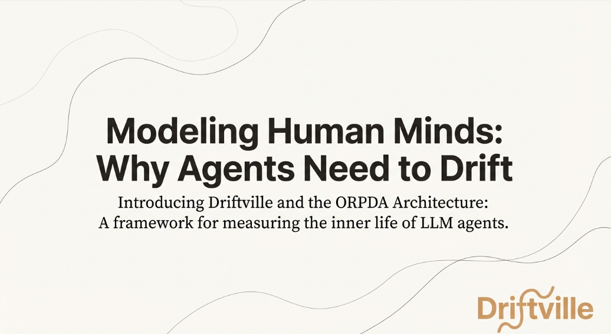
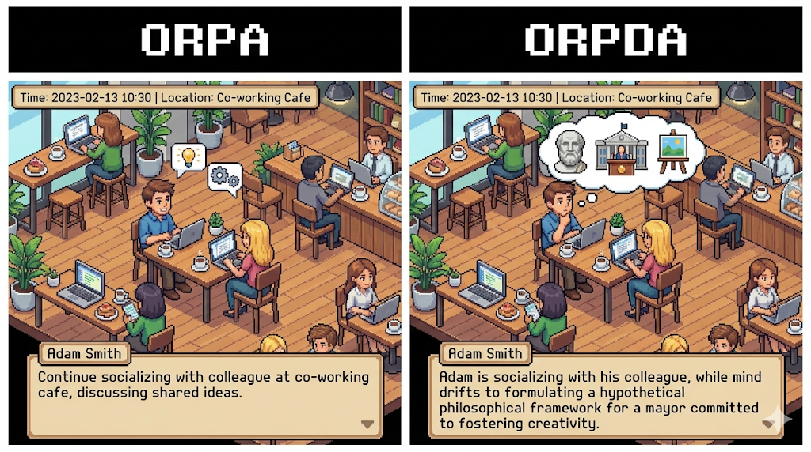
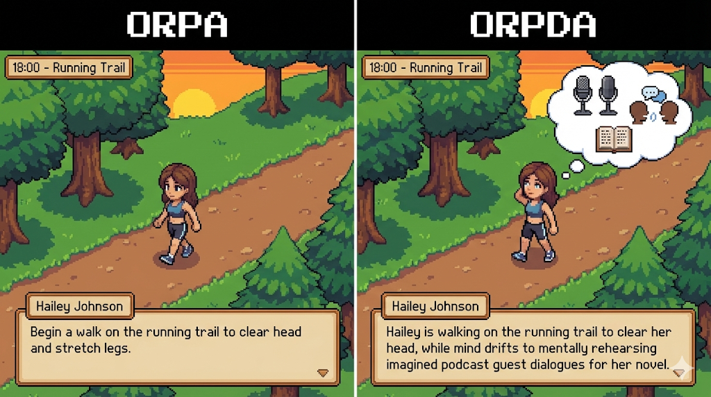
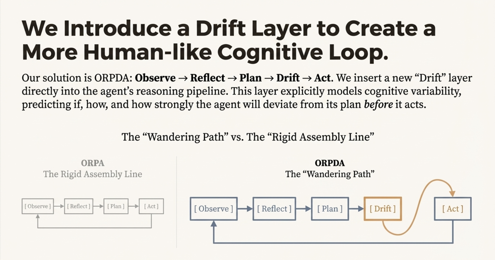
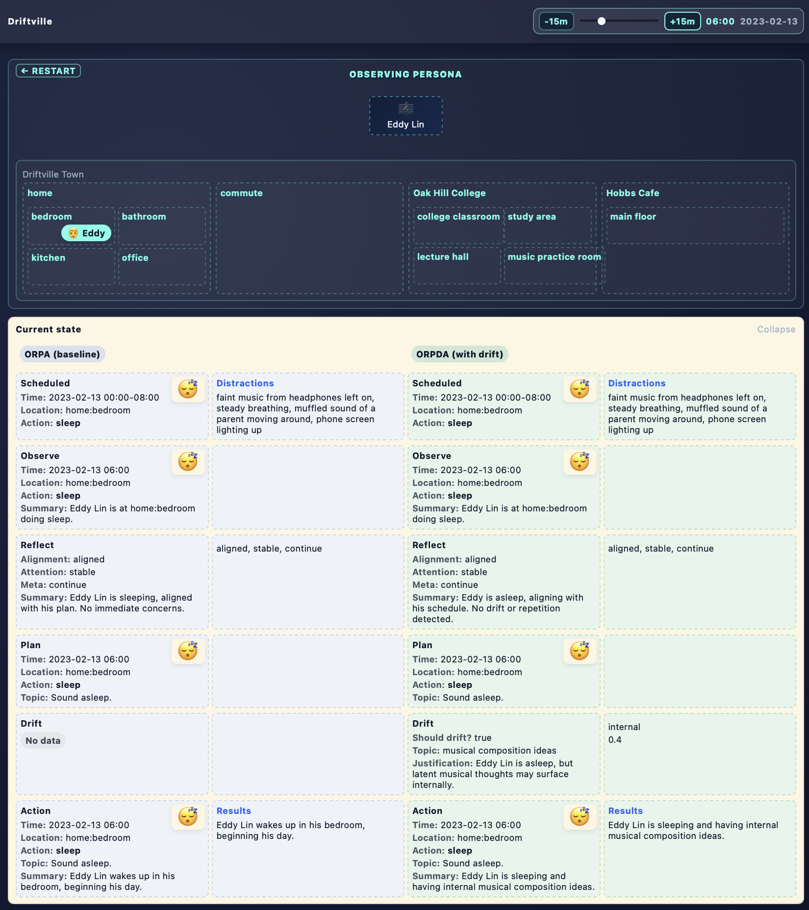

  

# Driftville — Human Mind Simulation Lab

Our quest started from a philosophical and anthropological question. **"What makes fulfilling life of a human?"** 

Aristotle argued that humans need other humans to flourish. Yet today, with AI empowering individuals to do more than ever, we're told we can become "superhuman" —solopreneurs, infinitely capable, endlessly productive. And while that empowerment is real, our lived experience repeatedly shows something deeper: **we grow beyond our limits when other humans enter the picture.**
Breakthroughs happen socially, not alone.

Our mission is to explore how minds meet—how individual inner voices become a collective intelligence. Growth rarely happens in isolation; it happens when our thinking is challenged, expanded, or stabilized by others. To understand this, we start with the mind itself: how it drifts, refocuses, imagines, and responds when alone or in the presence of others. These quiet internal movements shape so much of our happiness. Driftville is our long-term exploration of these dynamics—an invitation to study them together.

**🏡 What is Driftville?**

Driftville is a virtual town where we can observe the inner lives of human-like characters—not through scripted rules, but through the emergent behavior of LLM agents. Each character has an inner voice, attention pattern, and emotional drift that unfold naturally as the agent thinks, reacts, and re-orients over time.

Rather than predefining how a character should behave, Driftville lets cognition reveal itself.
The agents generate their own thoughts, lose focus, regain direction, shift topics, and form intentions—mirroring the subtle variability we see in real human minds.

It is a controlled cognitive environment where emergent inner behavior becomes visible, measurable, and open for study.

**🤖 Why AI Agent?**

LLM agents let us model cognition as a set of explicit, modular steps. Smallville showed that ORPA-style agents (Observe → Reflect → Plan → Act) can produce believable human-like external behavior. Driftville builds on this idea but goes deeper: by adding Drift as its own cognitive layer, we can observe internal variability—how attention wavers, how thoughts wander, and how mind-wandering reshapes decisions over time.
Separating each ORPDA step into its own agent makes the inner voice observable, measurable, and comparable—revealing patterns a single LLM call would never expose.

**🚀 What Problem Does ORPDA Solve?**

Humans rarely follow plans. Our mind wanders ~47% of waking hours.

Humans don’t think in straight lines. We drift, loop, ruminate, get distracted, recover, and shift emotional tone across the day. Yet LLM agents still rely on idealized cognitive loops like ORPA that assume stable attention and perfect goal-following. This creates a gap: when agents are used to model human-like thinking, coaching, decision-making, or prediction, they behave too cleanly—missing the subtle fluctuations that define real minds.

ORPDA addresses this gap by adding Drift as its own cognitive layer. It models the messy middle of human cognition: mind-wandering, topic leakage, emotional shifts, attention collapse, and recovery. This allows Driftville agents to behave less like perfect planners and more like believable human thinkers—making internal variability observable, measurable, and ready for study.

  

  

**✅ What Driftville makes possible.**

Driftville is a cognitive exploration environment — a place to study how minds think, drift, stabilize, and interact across different agent architectures and scenarios. It allows us to compare multiple models of cognition side-by-side and observe how inner lives evolve over time, alone or with others.

It enables insights that matter at every level:
- **For research**: a sandbox to study attention, drift, resilience, and emergent behavior with scientific traceability.
- **For individuals**: a way to understand how inner voices shift, recover, and influence daily well-being.
- **For teams & society**: a lens into how minds interact, stabilize each other, or create collective intelligence.
- **For enterprise**: a framework to evaluate agent reliability, coaching quality, decision support, and safety.
- **For AI alignment & safety**: a controlled environment to test how different cognitive architectures behave under drift, pressure, or ambiguity—supporting more predictable, interpretable, and human-aligned AI systems.

In short, Driftville turns internal cognition into something we can observe, measure, and improve—creating a foundation for safer AI, more human-aligned reasoning, and a deeper understanding of what supports real human flourishing.

## System Architecture (ORPDA)

  

  

ORPDA is a cognitive simulation loop designed to model and evaluate human-like variability in LLM reasoning. It extends the classic ORPA pipeline with an explicit Drift step:

Agent roles:
- **Observer**: emits structured state snapshots (`app/src/yaml/observer.yaml`).
- **Reflector**: cross-tick executive governor; reviews what just happened, surfaces competing stimuli, and sets guardrails/meta-rules for the next 15 minutes (`app/src/yaml/reflector.yaml`).
- **Planner**: generates the next 15-min plan block (`app/src/yaml/planner.yaml`).
- **Drifter**: injects cognitive drift decisions (`app/src/yaml/drifter.yaml`).
- **Actor**: commits the executed action for the next loop (`app/src/yaml/actor_orpda.yaml`).

### Current Status (Drift Layer)
- **Achieved**: Added a dedicated Drift layer so mind-wandering is explicit, logged, and measurable (intensity/type). We now produce ORPA vs ORPDA logs and can quantify drift rates, types, and hourly patterns.
- **Instrumentation**: Drift metrics scripts (e.g., `tools/drift_analysis.py`) compute drift % by type, hour, action, and allow thresholding (e.g., 0.3/0.5/0.7) for “effective drift.”
- **Visualization**: Prompt generators (`tools/generate_scene_pairs.py`) and UI previews help align visuals with the current sim_time/location/action, including drift-aware scenes.
- **Not Yet / Known Gaps**: Drift priors are still too permissive for some high-focus tasks; DMN-like patterns are not yet matched (e.g., writing/customer_service drifting too often). Label styling and UI are improving but not final. No longitudinal human baseline comparison yet.
- **Meaningful Next Steps**: Tighten drifter gating (task-aware priors, boredom/fatigue thresholds), improve reflector pressure signals, align drift rates toward ~40–50% with realistic per-task variability, UI improvement, add automated ablation tests, and compare against human time-use/DMN literature.
- **Help Wanted**: Contributions on drift priors/thresholding, evaluation design (DMN-aligned benchmarks), UI polish for ORPA/ORPDA labeling, and data/analysis to validate against human baselines.

## Quick Start
Foundation: Python, Google ADK, Flask, Gemini model/embedding model, Langfuse
Package management: Poetry

  

Prereqs: Python 3.12+

1) **Env vars**: create .env with your `GOOGLE_API_KEY`, `LANGFUSE_SECRET_KEY`, `LANGFUSE_PUBLIC_KEY`, `LANGFUSE_BASE_URL`.
2) **Install Poetry** (if needed):
   `curl -sSL https://install.python-poetry.org | python3 -`
  
   (or `pipx install poetry`)
3) **Install deps** (no packaging): `poetry install --no-root --with dev
`
4) **Set config**: in `app/config/config.yaml`
  - set `model_name` to be used by agents (default: `gemini-2.5-flash-lite`).
  - set `embedding_model_name` to be used to create inherent drift flag (default: `text-embedding-004`).
  - set `use_drift` to **True** (to run ORPDA loop).
  - set `use_drift` to **False** (to run ORPA loop).	
  - `persona`: which persona to simulate
  - `num_ticks`, `sim_start_time`: simulation length/start
  - `load_prompt_from_langfuse`: set to `True` to load agent instructions from Langfuse; `False` uses local YAML.
  - Ensure `.env` has your Langfuse credentials if you set `load_prompt_from_langfuse=True`.

5) **Run main simulation**: `poetry run python app/src/simulate.py` (it generates logs to `app/logs/`).

6) **UI preview** (visual only; no ORPDA execution yet):
   `poetry run python app2/app2.py`
   Then open the printed URL (default: http://127.0.0.1:5000)

	

## YAML vs Langfuse prompts
- Agent graph YAML lives in `app/src/yaml/` 
- When `LOAD_PROMPT_FROM_LANGFUSE=false`: YAML `instruction` fields are used.
- When `LOAD_PROMPT_FROM_LANGFUSE=true`: LLM instructions are pulled from Langfuse (latest label) using these prompt IDs:
  - reflector_prompt_path: "reflector"
  - planner_prompt_path: "planner"
  - drifter_prompt_path: "drifter"
  - actor_prompt_path: "actor_orpda" (or "actor_orpa" when drift is off)
- Ensure your Langfuse project has those prompts and `.env` contains your Langfuse credentials.
- Sequence remains `observer_symbolic` → reflector → planner → drifter → actor as defined in `orpda_sequence.yaml`.

## Logs
- Session logs (raw ORPDA loop output): `app/logs/session_*.log`
- Memory streams (summarized long-term memory): `app/logs/memory_streams*.log`

## Metrics & Ablation
- The effecitve ness of "D" (drift) layer is tested by ablation. 
- `app/src/utils/viz_metrics.ipynb` compares ORPDA (with drift) vs ORPA (no drift).
- Outputs: Plots saved to `app/img/`.

## Personas
- Raw bios: `app/src/smallville_personas.json` (Copied from `https://reverie.herokuapp.com/UIST_Demo/`. Used as SEED personality for Driftville. )
- Driftville personas and schedules: `app/src/driftville_personas.json`
- UI persona loader (arcade-style): `app2/app2.py`

## License

This project is licensed under the Apache 2.0 License.  

It allows open collaboration, reuse, and contributions while ensuring strong protection against patent-related restrictions.  
See the [LICENSE](./LICENSE) file for full details.

## Contributing 

DriftVille is an open collaborative space for exploring ORPDA,
a novel agent-orchestration approach inspired by ORPA but extended for:
- step-wise inspectable reasoning
- drift detection and evaluation
- multi-agent (A2A) conversations
- UI-based visualization of each loop step
- community-driven research on agent cognition

We welcome contributions from researchers, engineers, and students.

Ways you can contribute
- Improve ORPDA logic or add new reasoning steps
- Build or enhance the DriftVille UI
- Add new agents or multi-agent conversation flows
- Improve evaluation, drift metrics, or log visualizations
- Extend examples, tutorials, or documentation
- Fix bugs and improve code clarity
- Conduct research using DriftVille and share insights

Open an Issue or Pull Request to get started — no contribution is too small.

## Referenced work:
This project draws conceptual inspiration from Smallville (Park et al., 2023) but diverges significantly in scope and methodology, focusing on internal cognitive modeling rather than multi-agent social emergence.

In contrast to social-emergence environments like Smallville (2023), Driftville focuses on cognitive fidelity over social fidelity. It is not about building towns—it is about understanding minds.
By providing drift-aware reasoning, memory streams, and structured ablation metrics, Driftville supports both academic research and real-world agent evaluation.

1) Smallville

Joon Sung Park, Joseph O'Brien, Carrie Jun Cai, Meredith Ringel Morris, Percy Liang, and Michael S. Bernstein. 2023. Generative Agents: Interactive Simulacra of Human Behavior. In Proceedings of the 36th Annual ACM Symposium on User Interface Software and Technology (UIST '23). Association for Computing Machinery, New York, NY, USA, Article 2, 1–22. https://doi.org/10.1145/3586183.3606763

2) Neuroscience paper about Default Mode Network (DMN):
  
Alves, P.N., Foulon, C., Karolis, V. et al. An improved neuroanatomical model of the default-mode network reconciles previous neuroimaging and neuropathological findings. Commun Biol 2, 370 (2019). https://doi.org/10.1038/s42003-019-0611-3

3) Article about wandering mind stats being 47%:
  
https://news.harvard.edu/gazette/story/2010/11/wandering-mind-not-a-happy-mind/

Matthew A. Killingsworth, Daniel T. Gilbert ,A Wandering Mind Is an Unhappy Mind.Science330,932-932(2010).[DOI:10.1126/science.1192439](https://doi.org/10.1126/science.1192439)

  

``
