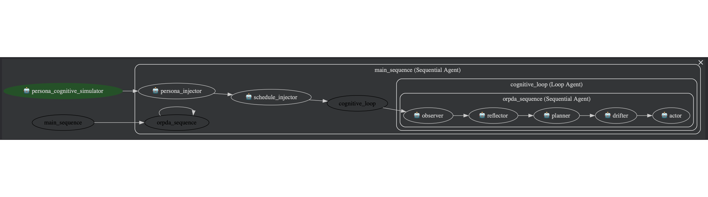

# Driftville: Understanding LLM Attention, Drift, and Emotional Stability Through ORPDA

A cognitive simulation framework that models and evaluates an LLM agent’s internal reasoning loop (Observe → Reflect → Plan → Drift → Act) to study attention stability, behavioral drift, emotional resilience, and long-horizon planning.

**Why Driftville?**

Most LLM agents today operate inside simplified cognitive loops—typically variants of Observe → Reflect → Plan → Act. These architectures assume stable attention, perfect goal adherence, and minimal internal variability. Real humans do not behave this way. We drift, ruminate, get distracted, recover, and reorient throughout the day.

**Driftville was designed to close this gap.**

This framework introduces ORPDA, a novel cognitive cycle that explicitly models drift as a first-class operator. By instrumenting an agent’s internal reasoning steps and evaluating its behavior over long simulated timelines, Driftville enables:
	•	Research-grade analysis of attention stability, cognitive drift, and emotional resilience
	•	Quantitative comparisons between idealized agents (ORPA) and realistic agents (ORPDA)
	•	Transparent, interpretable traces that reveal how an LLM’s internal “inner voice” evolves over time
	•	Benchmarking of agent personas for coaching, education, enterprise decision-making, and human-facing applications
	•	A sandbox for behavioral experiments, including conflict simulation, team dynamics, and population-level cognitive modeling

In contrast to social-emergence environments like Smallville (2023), Driftville focuses on cognitive fidelity over social fidelity. It is not about building towns—it is about understanding minds.
By providing drift-aware reasoning, memory streams, and structured ablation metrics, Driftville supports both academic research and real-world agent evaluation.

## Quick Start
1) activate your env first: Enter your `GOOGLE_API_KEY` in .env
2) Install deps: `pip install -r requirements.txt`
2) Set model in `app/config/config.yaml` (e.g., gemini-2.5-flash-lite).
3) UI status: the Driftville page is visualization-only (no live ORPDA wiring yet). To preview the layout:
   python app2/app2.py
   visit the printed URL (default http://127.0.0.1:5000)

## ORPDA Loop
- YAML agent configs live in `app/src/yaml/` (`root_agent.yaml`, `observer.yaml`, etc.).
- Programmatic runner: `app/src/orpda_runner.py` exposes `run_orpda_cycle(ctx)`; call with a context dict (raw persona, last_action_result, recent_history, current_datetime).

## Simulation CLI
- `app/src/simulate.py` runs a ticked ORPDA loop over personas in `app/src/driftville_personas.json`.
- Run with package import safety:
   python -m app.src.simulate
- To control start time (after adding the argparse flag as needed), pass `--sim-start "YYYY-MM-DD HH:MM"`.

## Logs
- Session logs (raw ORPDA loop output): `app/logs/session_*.log`
- Memory streams (summarized long-term memory): `app/logs/memory_streams*.log`

## Metrics & Ablation
- `app/src/metrics.py` compares ORPDA (with drift) vs ORPA (no drift).
- Compute and plot:
   python -m app.src.metrics
- Outputs: `app/logs/metrics.json`.

## Personas
- Raw bios: `app/src/smallville_personas.json` (Copied from `https://reverie.herokuapp.com/UIST_Demo/`. Used as SEED personality for Driftville. )
- Driftville personas and schedules: `app/src/driftville_personas.json`
- UI persona loader (arcade-style): `app2/app2.py`

## Config
- Model selection: `app/config/config.yaml` (`MODEL_NAME` used by agents).
- Additional personas: add to `driftville_personas.json` with schedule blocks; raw bios can go into `smallville_personas.json`.

## Development Notes
- Keep `sys.path` setup at the top of scripts when running as plain Python (`Path(__file__).resolve().parents[2]`).
- Avoid hard resets; logs are useful for debugging.
